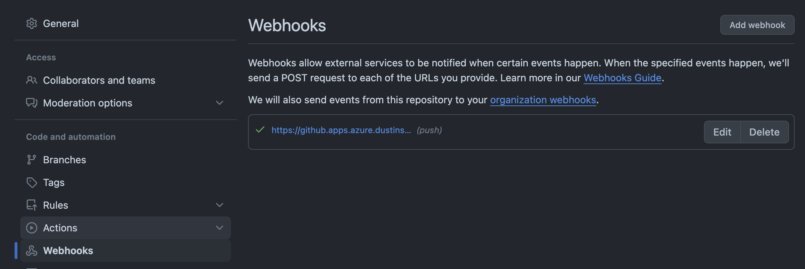
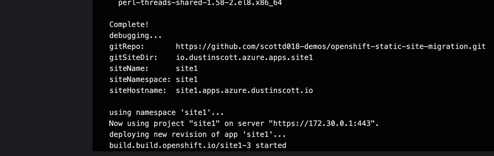
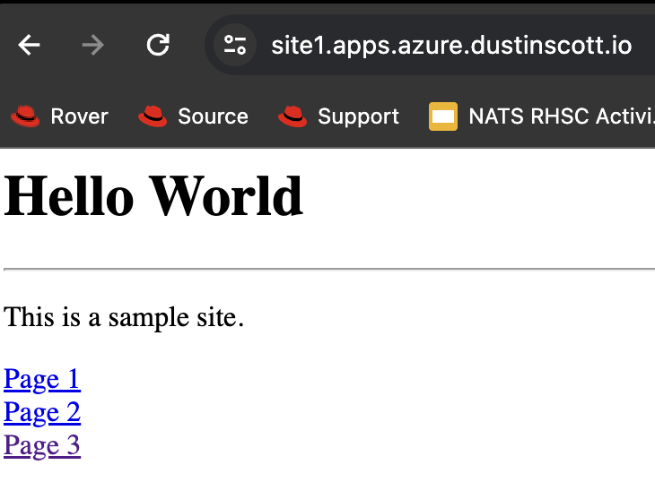
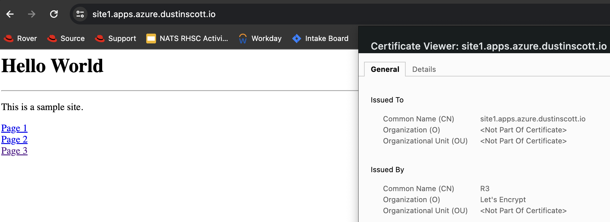
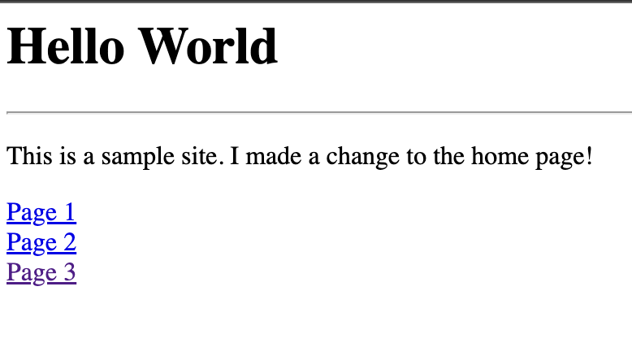

# Summary

This repo shows a simple modern workflow for a traditional HTML website running on OpenShift serving static content.  It includes 
the following:

1. A pipeline to deploy the latest content (using [OpenShift Pipelines](https://docs.openshift.com/pipelines/1.14/about/understanding-openshift-pipelines.html))
2. A [source-to-image](https://docs.openshift.com/container-platform/4.14/openshift_images/using_images/using-s21-images.html) process to deliver the content as a container
3. An automated certificate rotation using [public certificates with cert-manager](https://docs.openshift.com/container-platform/4.14/security/cert_manager_operator/cert-manager-operator-issuer-acme.html)

> **WARN:** I have not put a ton of validation into this walkthrough.  If you want a positive outcome, I would suggest 
> following it step-by-step unless you know what you are doing.  This was tested against lightly used clusters and 
> precautions should be taken against clusters which are used for real purposes.  Issues and PRs welcome!


## Personas

This walkthrough makes use of 2 personas:

1. Cluster Admin - responsible for platform setup and configuration as well as external configuration such as DNS.  
In this walkthrough, the relevant examples of cluster-admin responsibility (either indirect or direct responsibility) are:

* Operators such as cert-manager
* Ingress for the public domain
* Certificate Issuer configuration for requesting public certificates
* Re-usable pipeline resources
* RBAC for developer users to allow management of pipelines

1. Developer - responsible for submitting website code into a git repo and monitoring pipelines upon updates


## Walkthrough

This walkthrough assumes that the cluster admin has access to the following:

* A public DNS domain - this is a domain that is available on the public internet and is able to have DNS records 
inserted by the cluster admin.  The DNS records are both to allow ingress into the cluster, and to request public
certificates to front the website


### Cluster Admins


#### Setup 

1. First, we must ensure that we have all of the appropriate operators installed:

```bash
make operators
```

2. There is also a cert-manager project that allows us to easily inject certificates into our OpenShift routes
that should be considered and is used for this walkthrough (https://github.com/cert-manager/openshift-routes):

```bash
make cert-manager-route
```


#### Create Public Certificate Issuer

> **NOTE:** the below is for ease of walkthrough.  Be sure to use your appropriate DNS provider to meet challenge 
> requirements if you need to.  Full walkthroughs are at https://cert-manager.io/docs/configuration/acme/dns01/.

1. First, we need to ensure that our domain in Azure DNS is publicly available.  From any client, you can check 
this with:

```bash
nslookup test.example.com
```

For me, I injected a record named `test` so that I can test resolution.  It is delegated from my top-level domain.


And I can resolve it appropriately:

```bash
nslookup test.azure.dustinscott.io 8.8.8.8
Server:         8.8.8.8
Address:        8.8.8.8#53

Non-authoritative answer:
Name:   test.azure.dustinscott.io
Address: 10.10.10.10
```

2. Next, we need to register a domain so that we have the ability to request public certificates from an ACME server.  
This can be done one of MANY ways, but the purposes of this walkthrough, we are going to us AzureDNS.  If you have a 
domain such as Route53, feel free to skip this step, but understand you will need to 
configure your issuer appropriately (see `kubernetes/public-issuer.yaml`).

To begin this process, we first need to create a service principal which has access to update your Azure DNS zone.  The 
service principal credentials are stored at `azure-sp.json` (but they are not checked into git):

> **NOTE:** there are other ways to inject credentials such as managed identity.  I am doing this on an [Azure Red Hat OpenShift](https://azure.microsoft.com/en-us/products/openshift)
> cluster which does not yet support managed identity as of this writing. Feel free to select a different method if you 
> prefer but understand the steps in this walkthrough will change.  See 
> https://cert-manager.io/docs/configuration/acme/dns01/azuredns/#service-principal for more details. 

```bash
make azure-sp
```

1. Next, we need to create a secret containing the service principal password from the previous step:

```bash
make azure-secret
```

1. Using the service principal attributes, we will create a `ClusterIssuer` resource and a wild card certificate for 
our apps domain.  The `ClusterIssuer` is used to generate public certs for our domain, but it must be validated, so 
cert-manager needs to update the zone appropriately to validate:

```bash
make public-issuer
```


#### Create Public Ingress Controller

1. Next, we must create an ingress controller that is tied to our public domain and uses the certificate from above by default:

```bash
DOMAIN=example.com make ingress-controller
```

1. Next, if one does not already exist, we must create a DNS record for the public domain that is tied back 
to the ingress controller that we just created:

```bash
make public-ip

# output sample:
# 40.10.10.10
```

Using the above example, I would want to create a DNS record for `*.example.com` that points to `40.10.10.10`.  This 
means that all DNS records under `example.com` (e.g. `mysite.example.com`) will be routed to `40.10.10.10` which is 
the public IP for the ingress load balancer.  The internal ingress controller handles routing of traffic to the 
appropriate services in the cluster based on the `Route` configuration.

To ensure that this record works appropriately, you can do the following (using a fake record and your domain as a substitute) 
which should tie back to the ingress controller IP above:

```bash
nslookup fake.example.com

# output sample:
# Server:         172.100.0.1
# Address:        172.100.0.1#53

# Non-authoritative answer:
# Name:   test.example.com
# Address: 40.10.10.10
```


#### Create Pipelines

The pipelines are used to deliver website updates as the changes are checked into git.  You can install them as simply as:

```bash
make pipelines
```

Once installed, you will need to add a GitHub webhook to point at the listener.  This will send an event to the cluster 
each time a new change is detected in your GitHub site repo.  You need to use the following URL in your GitHub webhook
configuration (replacing MY_DOMAIN with your domain that your public ingresscontroller is serving):

```bash
https://github.${MY_DOMAIN}
```

You can do this by navigating to your GitHub repo, under `Settings > Webhooks` and adding the above URL as a webhook.  This 
allows GitHub to POST an event to the above listener each time a change is detected in the repo.  There are far more 
complicated configurations than this, but for simplicity, this assumes that each change is going to kickoff a 
pipeline run to deploy the new changes in the cluster:




#### Create Developer User

1. Create the developer user which will be used to show a developer that is able to write their website code, 
push to GitHub, and kickoff a deployment pipeline.

```bash
PASSWORD=<my-password> make developer
```

1. Login to the OpenShift cluster as the developer user:

```bash
make developer-login
```

1. Create the projects which will host each individual site.  For this walkthrough, we are assuming the use of 
one project per site.

```bash
make projects
```

1. Make a configuration change to any of this website and push changes to the repo.  You will see the pipeline 
kick off and you can view logs and view your changes at the posted URL.  Each time you make a change, a new 
revision of the site is deployed.

* Navigate to `Pipelines > PipelineRuns > Logs` in the `website-pipeline` project to view the run:



* View the Web Site 



* Observe the Secure Certificate



* Make a Change

```bash
git commit -a -m "feat: my change"
git push
```

* View the Changes




* Profit....
